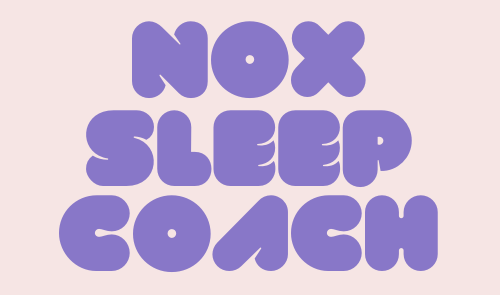
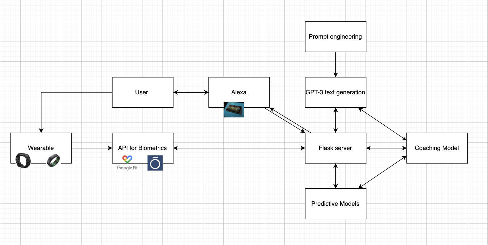

# HackZurich

---

### Table of Contents

- [Description](#description)
- [Diagram](#diagram)
- [Folder structure](#how-to-use)
- [Author Info](#author-info)

---

## Description

Nox is your virtual sleep coach to support YOU to fall asleep FASTER and SMARTER. Through IoB (Internet of Bedrooms) we are combining wearables and smart speakers using GPT-3 to provide personal insightful information and biometric data while utilizing the power of artificial intelligence to personally coach YOU to fall asleep - Nox out.

---

## Diagram

---

## Folder structure

### amazonSkillSet

Lambda functions to build services that give new skills to Amazon Echo. Amazon Echo Skill Kit provides the APIs, tools, and documentation to create these new skills, powered by running Lambda functions.

### googleFit

Fetching of personal sleep data from Google Fit (https://www.googleapis.com/auth/fitness.sleep.read). Data parsing.

### models 

Model testing and evaluation in [Google Colab](https://colab.research.google.com/drive/1JqCWDZx6_NY8sxCxCiGvXlV9dTdaSSia?usp=sharing). Tested was [EleutherAI/gpt-j-6B](https://huggingface.co/EleutherAI/gpt-j-6B), [facebook/blenderbot-400M-distill](facebook/blenderbot-400M-distill), [bigscience/bloom](https://huggingface.co/bigscience/bloom) and [GPT-3](https://beta.openai.com/playground). Choosen model for prodution because of best delivered output based on test prompts is GPT-3.

---

## Author Info

- [Markus Schinle](https://github.com/maschinle)
- [Marius Gerdes](https://github.com/nobodyz)
- [Katharina Kreitner](https://github.com/Katharina2K)
- [Simon Feralitas](https://github.com/Feralitas)
- [Max Hager](https://github.com/yachty66)

[Back To The Top](#read-me-template)

